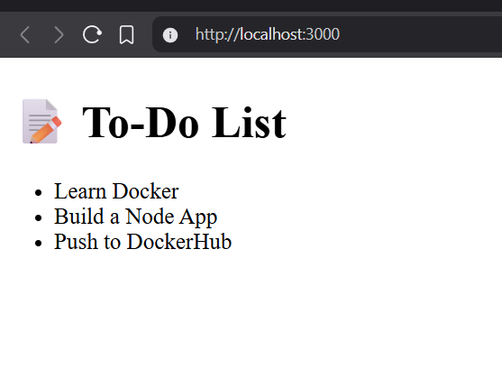

# 🧱 Dockerized Node.js To-Do App

A lightweight and fully Dockerized Node.js application that serves a static To-Do list through Express. This project demonstrates how to package a Node.js app into a Docker container and push it to DockerHub for easy deployment.

---

## ✨ Features

* ⚡ Fast and minimal Express backend
* 📃 Static HTML page rendered via Docker container
* 🐳 Dockerfile + .dockerignore setup
* 📦 Published to DockerHub
* 🔁 Easy to run on any system with Docker installed

---

## 🛠️ Tech Stack

* **Node.js**
* **Express.js**
* **HTML/CSS**
* **Docker**

---

## 🚀 Live Demo

You can run this app locally using Docker:

```bash
docker pull tejeshkumar/todo-app
docker run -d -p 3000:3000 tejeshkumar/todo-app
```

Then open 👉 [http://localhost:3000](http://localhost:3000)

---

## 🧰 Getting Started (Local Build & Run)

### 1️⃣ Clone the Repository

```bash
git clone https://github.com/tejeshkumar/docker-node-todo-app.git
cd docker-node-todo-app
```

### 2️⃣ Build Docker Image

```bash
docker build -t tejeshkumar/todo-app .
```

### 3️⃣ Run Container

```bash
docker run -d -p 3000:3000 tejeshkumar/todo-app
```

Visit: [http://localhost:3000](http://localhost:3000)

---

## 📤 Push to DockerHub

> You’ll need a [DockerHub](https://hub.docker.com/) account.

### 1. Login to Docker

```bash
docker login
```

### 2. Push the Image

```bash
docker push tejeshkumar/todo-app
```

---

## 📁 Folder Structure

```
docker-node-todo-app/
├── app.js               # Express backend
├── package.json         # Node dependencies
├── Dockerfile           # Docker config
├── .dockerignore        # Ignored files during build
├── public/
│   └── index.html       # Frontend UI
```

---

## 📸 Screenshots

> 

---

## 🤝 Contributing

Pull requests are welcome! If you'd like to improve the UI or add features (like dynamic To-Do items), feel free to fork the repo and create a PR.

---


## 🙌 Acknowledgments

Thanks to the open-source community and Docker for making deployment so seamless. Happy coding! 💻🚢
